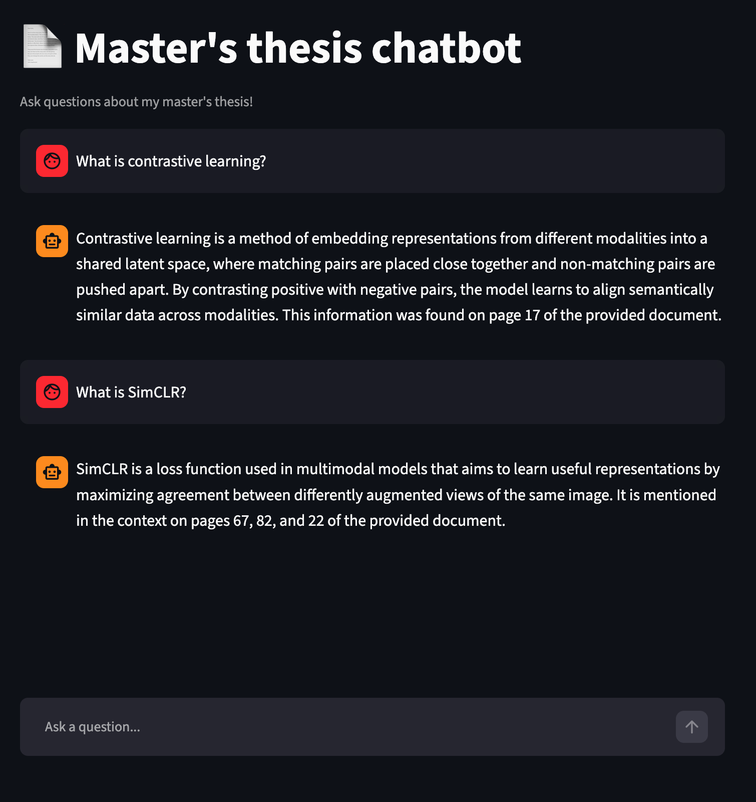

# RAG Document Chatbot

A document question-answering chatbot powered by Retrieval-Augmented Generation (RAG). Upload PDF documents and ask questions about their content in natural language.

## Demo



## Architecture



## Tech Stack

- **LangChain** – RAG pipeline orchestration
- **OpenAI** – Embeddings (`text-embedding-3-small`) and LLM (`gpt-3.5-turbo`)
- **ChromaDB** – Vector store for document embeddings
- **FastAPI** – REST API backend
- **Streamlit** – Chat frontend
- **Docker** – Containerized deployment

## Project Structure

```
rag-document-chatbot/
├── app/
│   ├── ingest.py        # PDF loading, chunking, embedding
│   ├── retriever.py     # Vector store retrieval
│   ├── chain.py         # LangChain RAG chain
│   └── api.py           # FastAPI endpoints
├── frontend/
│   └── streamlit_app.py # Chat UI
├── data/
│   └── documents/       # Place PDFs here
├── tests/
│   └── test_chain.py    # pytest tests
├── Dockerfile
├── docker-compose.yaml
└── pyproject.toml
```

## Setup

### Prerequisites

- Docker + Docker Compose
- OpenAI API key

### Run with Docker

1. Clone the repository:

```bash
git clone https://github.com/philscho/rag-document-chatbot.git
cd rag-document-chatbot
```

2. Add your OpenAI API key:

```bash
cp .env.example .env
# Edit .env and add your OPENAI_API_KEY
```

3. Add PDF documents to `data/documents/`

4. Run ingestion to index your documents:

```bash
docker-compose run api python -m app.ingest
```

5. Start the application:

```bash
docker-compose up
```

6. Open `http://localhost:8501` in your browser.

### Run locally

```bash
uv sync
cp .env.example .env
# Edit .env and add your OPENAI_API_KEY

# Index documents
uv run python -m app.ingest

# Start API
uv run uvicorn app.api:app --reload

# Start frontend (separate terminal)
uv run streamlit run frontend/streamlit_app.py
```

## API

| Endpoint | Method | Description |
|---|---|---|
| `/health` | GET | Health check |
| `/query` | POST | Query the document chatbot |
| `/docs` | GET | Swagger UI |

Example request:

```bash
curl -X POST http://localhost:8000/query \
  -H "Content-Type: application/json" \
  -d '{"question": "What is the main finding of the paper?"}'
```

## Tests

```bash
uv run pytest tests/ -v
```

## How It Works

1. **Ingestion** – PDFs are loaded page by page, split into chunks of 500 tokens with 50-token overlap, embedded using OpenAI embeddings, and stored in ChromaDB.
2. **Retrieval** – On each query, the `k=4` semantically most similar chunks are retrieved from ChromaDB.
3. **Generation** – Retrieved chunks are passed as context to GPT-3.5-turbo with an instruction to answer strictly based on the provided context and cite page numbers.